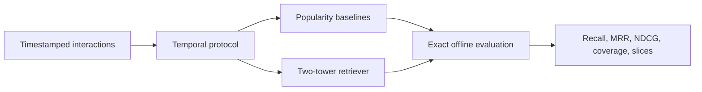
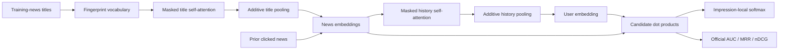

# RecomForge

Research infrastructure for studying modern multi-stage recommendation under strict temporal evaluation.

> **Status: R0–R1 complete; L1 three-seed title-encoder comparison complete; flagship evidence incomplete.** Full-data seed uncertainty and the controlled negative-sampling ablation are reported below. See the candid [`substantive quality audit`](docs/QUALITY_AUDIT.md) for the remaining scientific gates.

## Full-data development result

Three full-data seeds (156,965 training queries, three epochs, 73,152 development queries each) produce a stable relevance–coverage tradeoff. Values are mean ± sample standard deviation.

| Method | Recall@20 | Recall@100 | MRR@20 | Coverage@100 | Tail Recall@100 |
|---|---:|---:|---:|---:|---:|
| Global popularity | 0.00067 | 0.00894 | 0.00012 | 0.159% | 0.00000 |
| Time-decayed popularity | 0.00297 | 0.01439 | 0.00056 | 0.158% | 0.00000 |
| Two-tower, in-batch | 0.00333 ± 0.00016 | 0.01178 ± 0.00086 | 0.00159 ± 0.00007 | **93.259% ± 0.776%** | **0.00675 ± 0.00030** |
| Two-tower, uniform shared | **0.00683 ± 0.00082** | **0.05790 ± 0.00474** | **0.00232 ± 0.00019** | 1.111% ± 0.047% | 0.00000 ± 0.00000 |

Uniform negatives produce the strongest relevance metrics but collapse toward head items. In-batch clicked negatives are harder: they reduce Recall while producing radically broader catalog and nonzero tail coverage. Uniform wins Recall@100 in every paired seed by 0.0432–0.0506, while all three uniform runs have zero tail recall. The evidence falsifies the initial expectation that in-batch negatives would simply improve retrieval; negative-source choice changes the objective's behavior rather than offering a universal upgrade.

## Full-data official-ranking result

The full-data L1 comparison uses seeds 2027–2029, 64-dimensional representations,
three epochs, 709,032 sampled training examples per seed, and all 73,152 dev
impressions. Official metrics are computed from the unique ranks written to the
submission format, including the declared stable tie policy. Values are mean ±
sample standard deviation across training seeds; the hash tower is a single-seed
reference and is not included in the paired claim.

| Model | AUC | MRR | nDCG@5 | nDCG@10 | Parameters | CPU time |
|---|---:|---:|---:|---:|---:|---:|
| Global popularity‡ | 0.5385 | 0.2451 | 0.2501 | 0.3167 | 0 | 24.36 s |
| Time-decayed popularity (72h)‡ | 0.5393 | 0.2442 | 0.2501 | 0.3171 | 0 | 24.36 s§ |
| Hash two-tower, in-batch† | 0.5949 | 0.2805 | 0.3008 | 0.3629 | 74,048 | 50.83 s |
| Title mean + history mean | 0.5972 ± 0.0063 | 0.2689 ± 0.0071 | 0.2916 ± 0.0104 | 0.3565 ± 0.0078 | 1,218,048 | 200.1 ± 66.8 s |
| **Title attention + history mean** | **0.6283 ± 0.0040** | **0.2893 ± 0.0070** | **0.3179 ± 0.0079** | **0.3797 ± 0.0060** | 1,239,040 | 1,349.1 ± 342.6 s |

Title attention improves AUC over mean pooling by 0.03115 ± 0.00468 across seeds;
every seed clears the predeclared +0.02 gate. The per-seed 5,000-resample paired
bootstrap intervals are [0.02422, 0.02769], [0.03319, 0.03669], and [0.03089,
0.03430]. MRR and both nDCG effects are positive in every seed. The gain costs
6.74× the mean-pooling end-to-end CPU time when comparing the two three-seed
means, so this is a quality–compute tradeoff rather than a free improvement. See
the versioned [`three-seed aggregate`](experiments/mind-small/l1-full-three-seed-aggregate.json)
and seed-level comparison/bootstrap artifacts in `experiments/mind-small/`.

† Single seed; shown only as an earlier implementation reference.

‡ Deterministic training-only popularity counts; no evaluation labels or logged
position are used. § Both popularity predictions are produced in the same run, so
the shared runtime is shown for context rather than as per-variant latency. The
locked result is [`l1-logged-popularity.json`](experiments/mind-small/l1-logged-popularity.json).

## Research question

How much does each stage of a modern recommender—candidate retrieval, negative sampling, ranking, sequential modeling, multi-task learning, and reranking—contribute under a leakage-safe temporal protocol, and what relevance is traded for freshness and diversity?

## R0–R1 scope



R0 establishes data contracts, temporal validation, hand-tested metrics, and global/time-decayed popularity baselines. R1 will add a compact two-tower model and one controlled negative-sampling ablation after R0 is green.

## Evaluation policy

RecomForge treats these as different experiments:

- **Logged-impression ranking** orders only candidates that were displayed. It reports AUC, MRR, and NDCG.
- **Corpus retrieval** retrieves a target from an explicitly time-eligible item corpus. It reports Recall@K, MRR@K, coverage, slice quality, and latency.

Results from one protocol will never be presented as results from the other.

The project may also pursue the official MIND leaderboard as a distinct `mind_official_impression` track. It requires MIND-large hidden-test predictions and optimizes AUC/MRR/nDCG, not full-corpus coverage. The staged plan and anti-overfitting rules are in [`docs/LEADERBOARD_PLAN.md`](docs/LEADERBOARD_PLAN.md).
The frozen NRMS-style baseline question, model boundary, compute envelope, and
acceptance gates are in [`docs/L1_EXPERIMENT_SPEC.md`](docs/L1_EXPERIMENT_SPEC.md).

### Implemented L1 ranking path



The implementation uses explicit PyTorch modules and boolean masks; it does not
wrap an external recommendation framework.

Validate a generated official-format prediction file before packaging it:

```bash
recforge-mind-submission \
  --behaviors data/raw/mind-large/test/behaviors.tsv \
  --prediction runs/<run-id>/prediction.txt
```

The validator requires exact impression order, row count, candidate count, integer
ranks, and a complete rank permutation for every row.

## Quick start

Requires Python 3.11 or newer.

```bash
python -m venv .venv
source .venv/bin/activate
python -m pip install -e '.[dev]'
pytest
recforge-smoke
```

The smoke command uses generated data only and does not download MIND.

After preparing the gated MIND data and content artifact, run the bounded learned-model smoke experiment with:

```bash
recforge-r1 --config configs/experiments/r1_mind_smoke.json
```

Use `--seed 2028` (or another declared seed) to repeat an otherwise identical configuration; the resolved seed and full command are stored in the run manifest.

This configuration trains on 2,048 queries and evaluates 1,000 development impressions. Its logged-impression metrics validate the end-to-end path; they are not headline corpus-retrieval results.

After building the training-only title vocabulary, run the bounded L1 path with:

```bash
recforge-l1 --config configs/experiments/l1_mind_smoke.json
```

This path trains on 1,024 impression-local examples per epoch and evaluates 200
dev impressions. It writes an ignored checkpoint, immutable run manifest, metrics,
and candidate-aligned dev prediction file.

### L1 smoke result

| Train examples | Dev impressions | Parameters | AUC | MRR | nDCG@5 | nDCG@10 | CPU time |
|---:|---:|---:|---:|---:|---:|---:|---:|
| 1,024 × 2 | 200 | 619,776 | 0.5313 | 0.2459 | 0.2550 | 0.3312 | 48.09 s |

Training loss decreased from 1.8005 to 1.6590. This clean-commit, single-seed,
bounded run proves the L1 data/model/evaluation/artifact path, but it is not
evidence that NRMS beats the existing baseline. The immutable compact result is
[`experiments/mind-small/l1-smoke-result.json`](experiments/mind-small/l1-smoke-result.json).

The cached evaluator encodes each title once and batches user histories. On the
same frozen checkpoint and first 2,000 dev impressions, it exactly matches the
reference metrics while reducing evaluation time from 12.20 s to 1.53 s (7.97×)
on the recorded CPU environment. The AUC on this larger subset is only 0.5125,
which reinforces that the 200-impression smoke metric is not model-quality
evidence. See the immutable
[`evaluation benchmark`](experiments/mind-small/l1-evaluation-benchmark.json).

On all 73,152 MIND-small dev impressions, the cached evaluation itself completes
in 9.14 s (51.90 s including fresh-process imports and title-table construction)
and reports AUC 0.5212. This is useful systems evidence and a clear negative model-
quality result: the bounded checkpoint is nowhere near a competitive baseline.
The compact record is
[`l1-smoke-full-dev-evaluation.json`](experiments/mind-small/l1-smoke-full-dev-evaluation.json).

### Development smoke result

| Train queries × epochs | Dev impressions | AUC | MRR | NDCG@5 | NDCG@10 | CPU time |
|---:|---:|---:|---:|---:|---:|---:|
| 2,048 × 2 | 1,000 | 0.5263 | 0.2361 | 0.2423 | 0.3097 | 17.32 s |

The loss decreased from 5.5324 to 4.6476. MRR uses the official MIND
multi-positive definition. This single-seed subset run is an integration check,
not evidence that the model beats a baseline; wall time varies with local CPU load.

The same checkpoint reaches Recall@20 = 0.0000 and Recall@100 = 0.0025 against the reconstructed full temporal corpus, with 20.9% catalog coverage across the 1,000 top-100 lists. This deliberately small run is a negative result: the pipeline works, but 2,048 training queries are inadequate for corpus retrieval.

| Temporal-corpus method | Recall@20 | Recall@100 | MRR@20 | Coverage@100 |
|---|---:|---:|---:|---:|
| Global popularity | 0.00033 | 0.00708 | 0.00011 | 0.156% |
| Time-decayed popularity | **0.00133** | **0.01023** | **0.00043** | 0.155% |
| Two-tower smoke | 0.00000 | 0.00250 | 0.00000 | **20.900%** |

The popularity baselines win relevance on this bounded run, while the two-tower spreads recommendations across far more of the catalog. Full-data training is required before interpreting that relevance–coverage tradeoff.

## Limitations and negative results

- `temporal_corpus_v1` reconstructs item availability from first observation in
  released logs; it is a label-independent upper bound, not the publisher's true
  article timestamp.
- The current signed-hash two-tower is deliberately compact and is not a strong
  official-ranking text model. Its 2,048-query smoke result is below the
  popularity baselines on corpus relevance.
- Uniform negatives improve Recall@100 but collapse coverage and tail recall;
  they are not a universal replacement for clicked or hard negatives.
- MIND-small dev results are development evidence only. They are not official
  leaderboard results and do not establish online user benefit.
- The L1 smoke AUC changes from 0.5313 on the first 200 impressions to 0.5125 on
  the first 2,000. Small prefix subsets are integration fixtures, not a basis for
  model selection or headline claims.
- The full-data title-attention gain replicates across three training seeds, but
  its 6.74× mean CPU cost is material and peak memory remains unmeasured.
- The registered full-data history-attention ablation remains missing, so L1 is
  not yet complete.
- The released logs support offline counterfactual analysis only within their
  logged candidates; no causal or production-performance claim is made.

## Planned dataset

MIND-small is conditionally selected for the first external benchmark because it contains timestamps, ordered histories, logged impressions, and item text metadata. The dataset is research-only and gated; it will not be committed or automatically downloaded in CI.

## Roadmap

- [x] Define the R0–R1 research and evaluation contract.
- [x] Add typed schemas and deterministic synthetic fixtures.
- [x] Add hand-verifiable metrics and temporal leakage validation.
- [x] Add global and time-decayed popularity baselines.
- [x] Complete MIND-small authenticated download and integrity preflight.
- [x] Add a strict streaming MIND adapter and split-audit command.
- [x] Review and check in the compact MIND split report.
- [x] Add immutable metrics and run manifests.
- [x] Version the temporal candidate-universe policy and query builder.
- [x] Audit temporal corpus sizes and history filtering on MIND-small.
- [x] Implement and unit-test the two-tower core and in-batch loss.
- [x] Build deterministic, fingerprinted MIND content features and history aggregation.
- [x] Add deterministic training batches and duplicate-positive masking.
- [x] Add one config-driven train/evaluate command with checkpoint fingerprinting.
- [x] Add exact time-eligible corpus retrieval with history filtering and popularity slices.
- [x] Evaluate global and time-decayed popularity under the identical corpus protocol.
- [x] Run one full-data temporal-corpus development experiment on MIND-small.
- [x] Implement leakage-safe shared uniform negatives for the controlled ablation.
- [x] Compare uniform and in-batch negatives under a fixed model/data/optimizer budget.
- [x] Repeat the negative-sampling comparison across three seeds and report uncertainty.
- [x] Add an official MIND prediction writer and strict structural validator.
- [x] Match the official multi-positive MRR definition with a hand-checked test.
- [x] Add a deterministic training-only title vocabulary artifact and leakage tests.
- [x] Add and smoke-test the masked NRMS-style official-ranking path.
- [ ] Confirm access to MIND-large and reproduce all official metrics on its dev split.
- [x] Freeze and implement the L1 NRMS-style experiment and three-seed title-encoder comparison.
- [x] Add leakage-safe global and time-decayed logged-candidate popularity baselines.
- [ ] Run the registered full-data history-attention ablation.

See [`docs/EXPERIMENT_SPEC.md`](docs/EXPERIMENT_SPEC.md) for acceptance criteria and non-goals.
Dataset access and artifact-handling details are in [`docs/DATA.md`](docs/DATA.md).
The run-bundle format is documented in [`docs/RUNS.md`](docs/RUNS.md).
Paper-level result visualization contracts and visual-QA gates are documented in
[`docs/FIGURE_STANDARDS.md`](docs/FIGURE_STANDARDS.md).
The full-corpus eligibility approximation is documented in [`docs/decisions/0002-temporal-candidate-policy.md`](docs/decisions/0002-temporal-candidate-policy.md).
