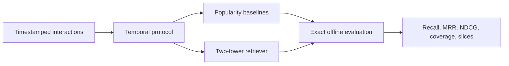

# RecForge

Research infrastructure for studying modern multi-stage recommendation under strict temporal evaluation.

> **Status: R0 complete; R1 retrieval in progress.** The protocol, synthetic fixtures, metrics, leakage validation, popularity baselines, run manifests, MIND adapter, and temporal-corpus audit are complete. The repository does not yet claim learned-model results.

## Research question

How much does each stage of a modern recommender—candidate retrieval, negative sampling, ranking, sequential modeling, multi-task learning, and reranking—contribute under a leakage-safe temporal protocol, and what relevance is traded for freshness and diversity?

## R0–R1 scope



R0 establishes data contracts, temporal validation, hand-tested metrics, and global/time-decayed popularity baselines. R1 will add a compact two-tower model and one controlled negative-sampling ablation after R0 is green.

## Evaluation policy

RecForge treats these as different experiments:

- **Logged-impression ranking** orders only candidates that were displayed. It reports AUC, MRR, and NDCG.
- **Corpus retrieval** retrieves a target from an explicitly time-eligible item corpus. It reports Recall@K, MRR@K, coverage, slice quality, and latency.

Results from one protocol will never be presented as results from the other.

## Quick start

Requires Python 3.11 or newer.

```bash
python -m venv .venv
source .venv/bin/activate
python -m pip install -e '.[dev]'
pytest
recforge-smoke
```

The smoke command uses generated data only and does not download MIND.

## Planned dataset

MIND-small is conditionally selected for the first external benchmark because it contains timestamps, ordered histories, logged impressions, and item text metadata. The dataset is research-only and gated; it will not be committed or automatically downloaded in CI.

## Roadmap

- [x] Define the R0–R1 research and evaluation contract.
- [x] Add typed schemas and deterministic synthetic fixtures.
- [x] Add hand-verifiable metrics and temporal leakage validation.
- [x] Add global and time-decayed popularity baselines.
- [x] Complete MIND-small authenticated download and integrity preflight.
- [x] Add a strict streaming MIND adapter and split-audit command.
- [x] Review and check in the compact MIND split report.
- [x] Add immutable metrics and run manifests.
- [x] Version the temporal candidate-universe policy and query builder.
- [x] Audit temporal corpus sizes and history filtering on MIND-small.
- [x] Implement and unit-test the two-tower core and in-batch loss.
- [x] Build deterministic, fingerprinted MIND content features and history aggregation.
- [x] Add deterministic training batches and duplicate-positive masking.
- [ ] Train and evaluate the retriever on MIND-small.
- [ ] Compare uniform and in-batch negatives under a fixed budget.

See [`docs/EXPERIMENT_SPEC.md`](docs/EXPERIMENT_SPEC.md) for acceptance criteria and non-goals.
Dataset access and artifact-handling details are in [`docs/DATA.md`](docs/DATA.md).
The run-bundle format is documented in [`docs/RUNS.md`](docs/RUNS.md).
The full-corpus eligibility approximation is documented in [`docs/decisions/0002-temporal-candidate-policy.md`](docs/decisions/0002-temporal-candidate-policy.md).
