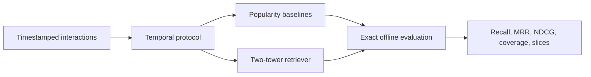

# RecomForge

Research infrastructure for studying modern multi-stage recommendation under strict temporal evaluation.

> **Status: R0 complete; R1 retrieval in progress.** One full-data development seed is reported below. Multi-seed uncertainty and the controlled negative-sampling ablation are still required before a final learned-model claim.

## Full-data development result

One full-data seed (156,965 training queries, three epochs, 73,152 development queries) gives a mixed but informative result:

| Method | Recall@20 | Recall@100 | MRR@20 | Coverage@100 | Tail Recall@100 |
|---|---:|---:|---:|---:|---:|
| Global popularity | 0.00067 | 0.00894 | 0.00012 | 0.159% | 0.00000 |
| Time-decayed popularity | 0.00297 | 0.01439 | 0.00056 | 0.158% | 0.00000 |
| Two-tower, in-batch | 0.00344 | 0.01174 | 0.00163 | **93.967%** | **0.00659** |
| Two-tower, uniform shared | **0.00596** | **0.05632** | **0.00210** | 1.145% | 0.00000 |

Uniform negatives produce the strongest relevance metrics but collapse toward head items. In-batch clicked negatives are harder: they reduce Recall while producing radically broader catalog and nonzero tail coverage. This single-seed result falsifies the initial expectation that in-batch negatives would simply improve retrieval; repeated seeds are required before treating the relevance–coverage tradeoff as stable.

## Research question

How much does each stage of a modern recommender—candidate retrieval, negative sampling, ranking, sequential modeling, multi-task learning, and reranking—contribute under a leakage-safe temporal protocol, and what relevance is traded for freshness and diversity?

## R0–R1 scope



R0 establishes data contracts, temporal validation, hand-tested metrics, and global/time-decayed popularity baselines. R1 will add a compact two-tower model and one controlled negative-sampling ablation after R0 is green.

## Evaluation policy

RecomForge treats these as different experiments:

- **Logged-impression ranking** orders only candidates that were displayed. It reports AUC, MRR, and NDCG.
- **Corpus retrieval** retrieves a target from an explicitly time-eligible item corpus. It reports Recall@K, MRR@K, coverage, slice quality, and latency.

Results from one protocol will never be presented as results from the other.

## Quick start

Requires Python 3.11 or newer.

```bash
python -m venv .venv
source .venv/bin/activate
python -m pip install -e '.[dev]'
pytest
recforge-smoke
```

The smoke command uses generated data only and does not download MIND.

After preparing the gated MIND data and content artifact, run the bounded learned-model smoke experiment with:

```bash
recforge-r1 --config configs/experiments/r1_mind_smoke.json
```

Use `--seed 2028` (or another declared seed) to repeat an otherwise identical configuration; the resolved seed and full command are stored in the run manifest.

This configuration trains on 2,048 queries and evaluates 1,000 development impressions. Its logged-impression metrics validate the end-to-end path; they are not headline corpus-retrieval results.

### Development smoke result

| Train queries × epochs | Dev impressions | AUC | MRR | NDCG@5 | NDCG@10 | CPU time |
|---:|---:|---:|---:|---:|---:|---:|
| 2,048 × 2 | 1,000 | 0.5263 | 0.2646 | 0.2423 | 0.3097 | 3.84 s |

The loss decreased from 5.5324 to 4.6476. This single-seed subset run is an integration check, not evidence that the model beats a baseline.

The same checkpoint reaches Recall@20 = 0.0000 and Recall@100 = 0.0025 against the reconstructed full temporal corpus, with 20.9% catalog coverage across the 1,000 top-100 lists. This deliberately small run is a negative result: the pipeline works, but 2,048 training queries are inadequate for corpus retrieval.

| Temporal-corpus method | Recall@20 | Recall@100 | MRR@20 | Coverage@100 |
|---|---:|---:|---:|---:|
| Global popularity | 0.00033 | 0.00708 | 0.00011 | 0.156% |
| Time-decayed popularity | **0.00133** | **0.01023** | **0.00043** | 0.155% |
| Two-tower smoke | 0.00000 | 0.00250 | 0.00000 | **20.900%** |

The popularity baselines win relevance on this bounded run, while the two-tower spreads recommendations across far more of the catalog. Full-data training is required before interpreting that relevance–coverage tradeoff.

## Planned dataset

MIND-small is conditionally selected for the first external benchmark because it contains timestamps, ordered histories, logged impressions, and item text metadata. The dataset is research-only and gated; it will not be committed or automatically downloaded in CI.

## Roadmap

- [x] Define the R0–R1 research and evaluation contract.
- [x] Add typed schemas and deterministic synthetic fixtures.
- [x] Add hand-verifiable metrics and temporal leakage validation.
- [x] Add global and time-decayed popularity baselines.
- [x] Complete MIND-small authenticated download and integrity preflight.
- [x] Add a strict streaming MIND adapter and split-audit command.
- [x] Review and check in the compact MIND split report.
- [x] Add immutable metrics and run manifests.
- [x] Version the temporal candidate-universe policy and query builder.
- [x] Audit temporal corpus sizes and history filtering on MIND-small.
- [x] Implement and unit-test the two-tower core and in-batch loss.
- [x] Build deterministic, fingerprinted MIND content features and history aggregation.
- [x] Add deterministic training batches and duplicate-positive masking.
- [x] Add one config-driven train/evaluate command with checkpoint fingerprinting.
- [x] Add exact time-eligible corpus retrieval with history filtering and popularity slices.
- [x] Evaluate global and time-decayed popularity under the identical corpus protocol.
- [x] Run one full-data temporal-corpus development experiment on MIND-small.
- [x] Implement leakage-safe shared uniform negatives for the controlled ablation.
- [x] Compare uniform and in-batch negatives under a fixed model/data/optimizer budget.
- [ ] Repeat final comparisons across seeds and report uncertainty.
- [ ] Compare uniform and in-batch negatives under a fixed budget.

See [`docs/EXPERIMENT_SPEC.md`](docs/EXPERIMENT_SPEC.md) for acceptance criteria and non-goals.
Dataset access and artifact-handling details are in [`docs/DATA.md`](docs/DATA.md).
The run-bundle format is documented in [`docs/RUNS.md`](docs/RUNS.md).
The full-corpus eligibility approximation is documented in [`docs/decisions/0002-temporal-candidate-policy.md`](docs/decisions/0002-temporal-candidate-policy.md).
